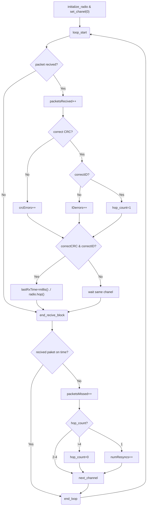
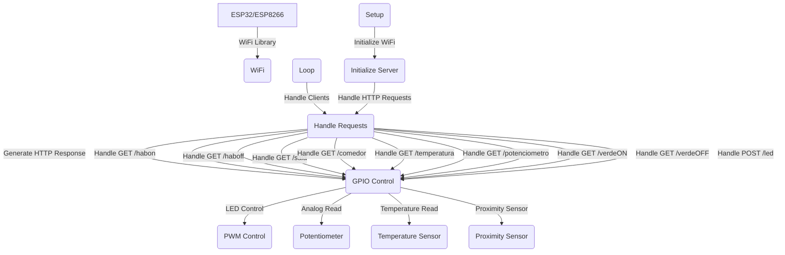

# NodoIoT_RFM69
# TFG: Implementación de nodo IoT para la captura y monitorización de datos de una estación meteorológica Davis
## Equipo:
### Hardware
Sensor Transmitter Davis 6331/2  
Sensor de temperatura y humedad Davis  
Placa Adafruit Adalogger FeatherWing  
PLaca Adafruit Radio FeatherWing  
Placa Adafruit Feather ESP32 V2  
Antena ...  
### Software  
Arduino IDE versión 2.2.1  
Placa Esp32 de espressif version 2.0.4  
## Conexiones pines:

### Placa Adafruit Feather ESP32 V2
SCK -> Pin 5  
MISO -> Pin 21  
MOSI -> Pin 19   
CS -> Pin 32  
IRQ -> Pin 27  
### Adafruit Radio FeatherWing

## Desarrollo.
Para el desarroyo de este proyecto se divirá en tres partes que de forma independiente se podrá testear las diferentes fases del proyecto: Recibir, Guardar y Enviar.  
Estas tres fases serán las implementadas en un archivo .ino que posteriormente serán junatadas en un archivo .ino final.  
### Recibir.
Esta fase tiene como objetivo recibir paquetes de las distintas estaciones con los datos obtenidos en sus sensores.  
El Sensor Transmitter Davis tiene en su interior 4 switches que dependiendo si estan en **ON** u **OFF** representan un canal u otro.

Dependiendo del canal escogido transmitirá mas o menos lento los paquetes segun la siguiente equación:  
**(41 + ID)/16 [segundos]**  
### Guardar.
### Enviar.  

 

